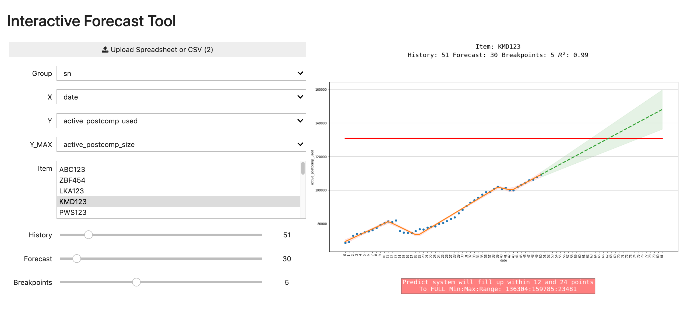

# Interactive Forecast Tool

## Installation

```
git clone https://github.com/maralski/ift.git
cd ift
conda env create -f environment.yml
```

## Run

```
conda activate ift
voila ift_notebook.ipynb
```

## Usage

Upload spreadsheet or CSV containing following columns:

- Group -> Item to plot
- X -> Metric to plot on X-axis (usually date column)
- Y -> Metric to plot on Y-axis
- Y_MAX -> Metric used to set max Y-value. Used to forecast when Y approaches Y_MAX.

Once data is upload and columns have been selected the item to graph based on **Group** column can be selected, followed by the history, forecast and breakpoints. The graph will update automatically as each widget is adjusted.

- Select "Item" to graph.
- Set **History** to number of points to look back.
- Set **Forecast** to number of points to project ahead.
- Set **Breakpoints** to number of breaks in piecewise linear regression.

The graph along with the goodness of fit and forecast will be produced. If **Y_MAX** is specified and the forecast reaches Y_MAX, the graph will include text describing the number of future points required to reach **Y_MAX**, along with the minimum Y, maxmimum Y and range between maximum and minimum Y.


